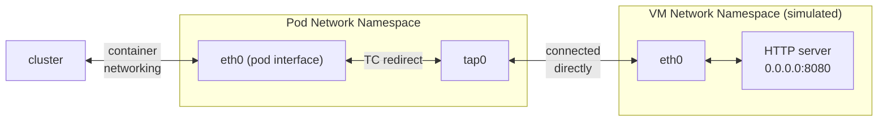

# Kata network simulator

This repo simulates the basic network setup of a [Kata] container, but in plain runc.
The following diagram shows the basic setup:



The provided `setup.sh` script creates a new network namespace to simulate the Kata VM.
The configuration of the pod's `eth0` interface is moved to the VM's `eth0`.
A pair of `tc(8)` rules is set up to forward traffic from the pod to the VM, and vice versa.

## Installation

This demo is installed as a kustomization:

```sh
kubectl create ns netns-challenge
kubectl apply -k .
```

## Challenge

See https://github.com/kata-containers/kata-containers/issues/1693.

Try accessing the HTTP server from another pod:

```sh
kubectl run -it --rm --restart=Never --image nicolaka/netshoot http-client -- curl $PODIP:8080/motd
```

This should print the netshoot motd to stdout.

Now try port-forwarding:

```sh
kubectl port-forward pod/$SERVERPOD 8080:8080
curl localhost:8080/motd
```

This should fail with a connection refused error.
The reason for this is that the CRI implementations basically exec into the pod's network namespace and do a connection to `localhost` from within.
Since the actual services are not running in that ns, and the tc rules redirect traffic away, this can't work.


[Kata]: https://github.com/kata-containers/kata-containers
